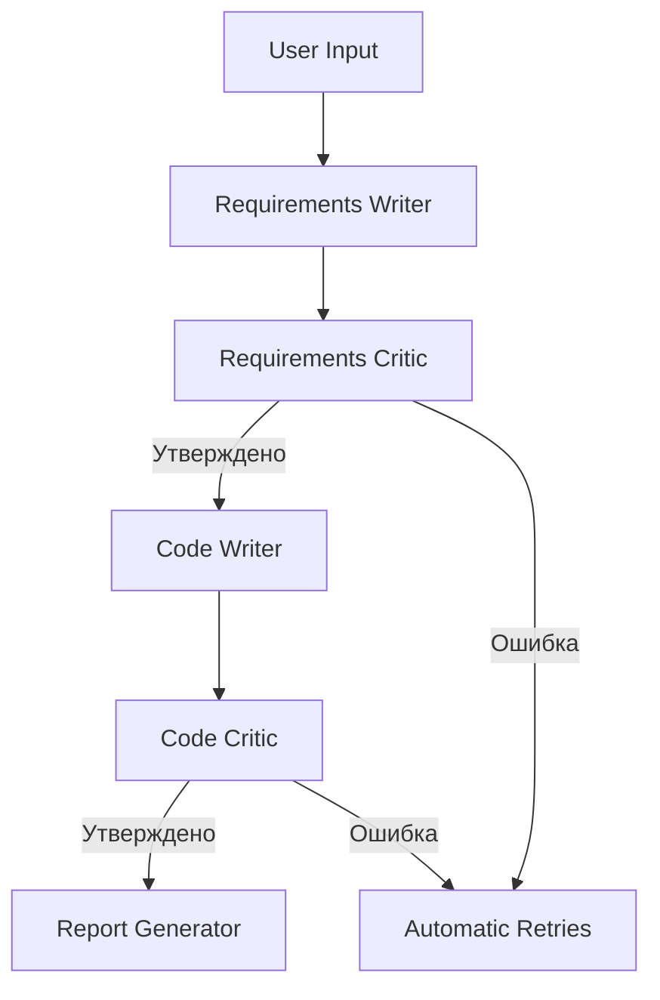

# Telegram WebApp Generator 🚀  

Система автоматической генерации Telegram WebApp приложений с проверкой требований и кода. Использует цепочку агентов на базе LangChain и OpenAI API.

---

## 🔧 Основные возможности  
- ✅ Генерация технических требований из пользовательского запроса  
- 📊 Критический анализ и улучшение требований  
- 💻 Автоматическое написание Python кода для Telegram WebApp  
- 🧪 Многоуровневая проверка кода с исправлением ошибок  
- 📄 Финальный отчет с рекомендациями  

---

## 📦 Требования  
```bash
pip install langchain langchain-openai openai python-dotenv
```

**API ключи:**  
1. Создайте `.env` файл с:
```env
OPENAI_API_KEY=your_openrouter_api_key
```

2. Поддерживаемые модели:
   - `qwen/qwq-32b:free` (по умолчанию)
   - `deepseek/deepseek-chat-v3-0324:free`

---

## ⚙️ Архитектура  


**Компоненты:**
- **BaseAgent**: Базовый класс с памятью и логированием  
- **RequirementsWriter/Critic**: Работа с требованиями  
- **CodeWriter/Critic**: Генерация и проверка кода  
- **AgentOrchestrator**: Управление workflow  

---

## 🚀 Использование  
```python
from agent_orchestrator import AgentOrchestrator

orchestrator = AgentOrchestrator()
user_request = "Создай интерактивную форму с полями имя, email и кнопкой отправки"

final_result = orchestrator.execute_workflow(user_request)

if final_result["state"] == "FINISHED":
    print(final_result["final_report"])
```

**Результат выполнения:**  
1. Генерация Tребований → 2. Анализ → 3. Написание кода → 4. Проверка → 5. Отчет  

---

## 📁 Структура проекта  
```
├── agents/
│   ├── base.py         # Базовая логика
│   ├── requirements.py # Агенты требований
│   ├── code.py         # Агенты кодирования
│   └── reporter.py     # Генератор отчетов
├── orchestrator.py     # Система управления
└── logs/               # Хранилище логов
```

---

## 📝 Пример вывода  
```text
Шаг 1: Requirements Writer...
[+] Требования сгенерированы успешно!

Шаг 2: Requirements Critic...
[✓] Требования одобрены (оценка: 9/10)

Шаг 3: Code Writer...
[!] Предупреждение: Детали реализации могут отличаться

Шаг 4: Code Critic...
[✓] Код прошел все проверки

✨ Итоговый отчет:
1. Исходные требования: ...
2. Критика: ...
3. Сгенерированный код: ...
4. Рекомендации: ...
```

---

## 📌 Лицензия  
MIT License - [LICENSE](LICENSE)  

---

## 🤝 Вклад  
Откройте issue для предложений или отправьте pull request.  

--- 

## 📬 Поддержка  
Создатель: [@your_github_handle]  
Telegram: https://t.me/your_username  

--- 

> *Генерация web-приложений Telegram за 5 шагов* 🎯